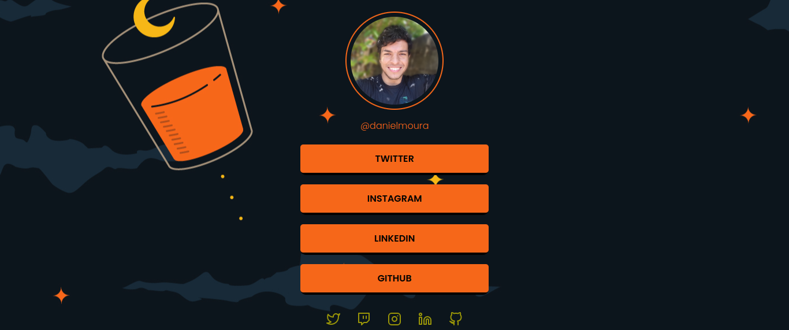

# **<center>Social Tree</center>**
> Nesse terceiro desafio do programa Discover da Rocketseat era criar uma página com uma lista de links (menu) que pode ser usada em perfis de redes sociais para direcionar o usuário para o local escolhido. Utilizando HTML e CSS.



> ## 🔗 [Clique aqui para acessar a página do projeto](https://danieldemoura.github.io/Social-Tree/)

## ✔️ **Requesitos para concluir o desafio**
- Adicione uma imagem de perfil
- Adicione uma lista de links que pode ser usada para enviar o usuário para outros sites
- Opcional: Adicione ícones com links para outras redes sociais
- Você poderá usar como modelo o layout do Figma para concluir o desafio

## ⚒️ **Techs utilizadas**
- HTML
- CSS
- Figma


## <center>🧑‍💻 **Código que faz as animações das LI**</center>

```

main ul li {
    background-color: rgb(0, 0, 0);
    border-radius: 10px;
    font-weight: 600;
    line-height: 49px;
    text-align: center;
    padding-bottom: 4px;

    animation: fromLeft .5s backwards;
}

main ul li:nth-of-type(1) {
    animation-delay: .5s;
}

main ul li:nth-of-type(2) {
    animation: fromRight .5s backwards;
    animation-delay: 1s;
}

main ul li:nth-of-type(3) {
    animation-delay: 1.5s;
}

main ul li:nth-of-type(4) {
    animation: fromRight .5s backwards;
    animation-delay: 2s;
}

/**
    Animation
*/

@keyframes fromLeft {
    from {
        opacity: 0;
        transform: translateX(-400px);
    }

    to {
        opacity: 1;
        transform: translateX(0px);
    }
}

@keyframes fromRight {
    from {
        opacity: 0;
        transform: translateX(400px);
    }

    to {
        opacity: 1;
        transform: translateX(0px);
    }
}

@keyframes fromBottom {
    from {
        opacity: 0;
        transform: translateY(400px);
    }

    to {
        opacity: 1;
        transform: translateX(0px);
    }
}
```